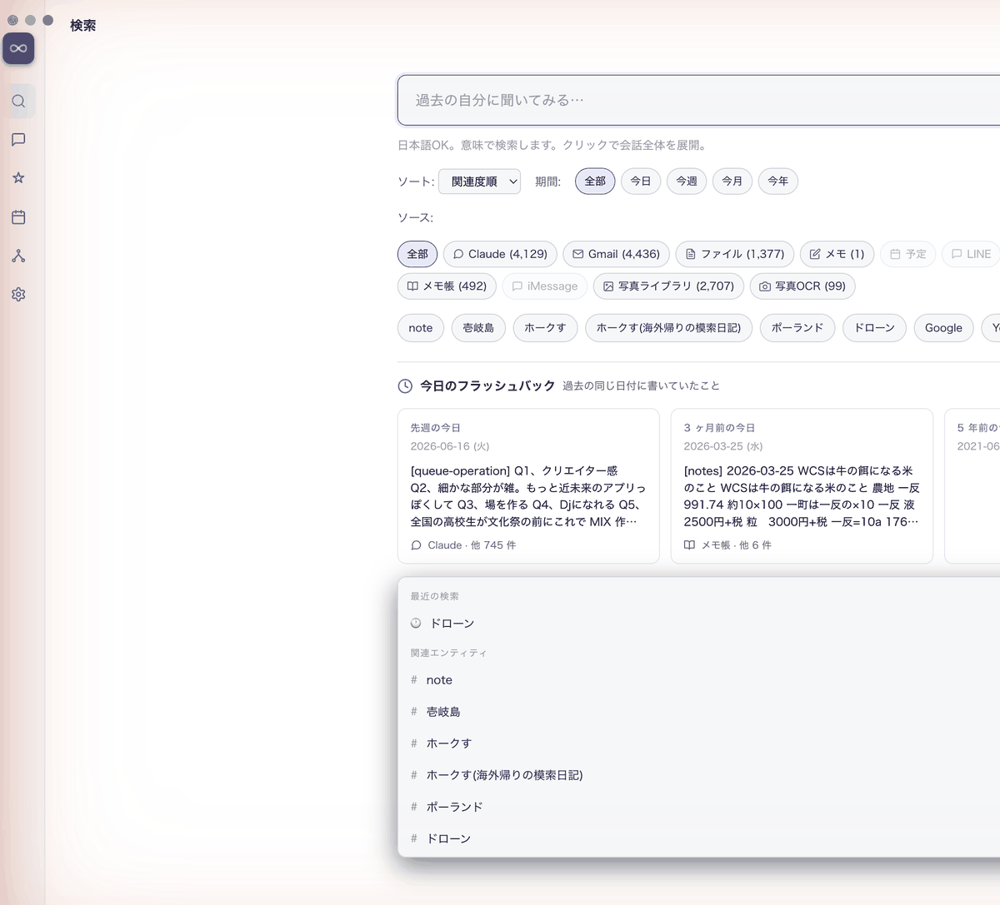

# 分身（Bunshin）

### **あなたの過去は、あなたのもの。**

メール、写真、会話、メモ、ファイル—
あなたが Mac で扱った全部を Bunshin が覚えていて、
**「あの時のあれ何だっけ」を AI が教えてくれる** Mac アプリ。

データは Mac の中だけ。ネット送信ゼロ。

[ダウンロード（macOS）](https://github.com/Marine923/bunshin-ai/releases/latest) &nbsp;·&nbsp;
[English README](./README.md) &nbsp;·&nbsp;
[使い方ガイド](./docs/SETUP.md)

  

  
  
  

---

## こんな時に便利

- 「あの店、メールに書いてあった気がするけど…いつだっけ」
- 「先月の写真、京都旅行のやつ全部出して」
- 「Claude に半年前に相談したな、なんて答えてもらったっけ」
- 「あのファイル、どこに保存したっけ」
- 「1 年前の今日、自分は何してた？」

→ Bunshin に聞けば、**全ソース横断**で探してくれます。

---

## 5 分で始める

1. **[ダウンロード](https://github.com/Marine923/bunshin-ai/releases/latest)** から `.dmg` を落とす
2. ダウンロードした `.dmg` を開く → **Bunshin を Applications にドラッグ**
3. Bunshin を起動 → **案内に沿って** Gmail / 写真 / メモを繋ぐ
4. 検索タブの **「今日のフラッシュバック」** から「1 年前の今日、自分が書いてたこと」を見てみる

---

## 何が安心？

| 約束 | 中身 |
|---|---|
| **データはあなたの Mac の中だけ** | 外部サーバーに送りません |
| **AI もローカル** | Ollama という無料の AI を使うので、Anthropic / OpenAI / Google にも送りません |
| **いつでも持ち出せる** | 設定タブから JSON / SQLite ファイルでエクスポート可能 |
| **公開されたコード** | 何をしているか全部見える（オープンソース）|
| **削除も自由** | `~/.bunshin/` フォルダごと消せば、痕跡ゼロで完全消去 |

---

## 他のアプリとの違い

| | ChatGPT 記憶 | Mem0 | Rewind | **Bunshin** |
|---|:---:|:---:|:---:|:---:|
| データ保管場所 | OpenAI のサーバー | クラウド | あなたの Mac | **あなたの Mac** |
| AI の切り替え | ❌ | ❌ | スクショベースのみ | **✅ どの AI でも** |
| オフラインで動く | ❌ | ❌ | ❌ | **✅** |
| メール・写真・メモを横断 | ❌（自分内のみ） | ❌ | スクショのみ | **✅ 11 種類のソース** |

※ Mem0 は OSS 版（自前ホスト可）もありますが、主力はクラウドサービスです。Bunshin はクラウド版を持たず、最初から最後まであなたの Mac の中だけで動きます。

---

## 入っているもの

| ▍ | 機能 | 何ができるか |
|---|---|---|
| 🔍 | **検索** | 過去の自分が触れた全部から、自然な日本語で探せる（LLM クエリ拡張がデフォルト ON、複数語クエリも取りこぼし減） |
| ✦ | **今日のフラッシュバック** | 1 年前・3 ヶ月前・先週の同じ日に書いてたことを毎朝見せてくれる |
| 💬 | **AI と相談** | 過去記憶を AI が読んだ上で答える（あなたの文脈を持ったまま）、応答に **コピー / 再生成 / 読み上げ** ボタン付き |
| 🕸 | **関係性** | 蜘蛛の巣ビュー（**type で色分け**：人物/場所/組織/プロジェクト/概念）+ 「**AI に説明させる**」(Wikipedia + DuckDuckGo + 公式サイト + Claude API 並列調査 → judge agent 選定) |
| 📸 | **写真の場所と旅行** | GPS 付き写真を地名 entity 化（壱岐市 / 長崎市 / Olsztyn County 等）+ 同じ場所×連続日付を「○○の旅行」イベントとして集約 |
| 📅 | **タイムライン** | リスト表示 / **GitHub 風 365 日ヒートマップ** 切替可能 |
| 🗑 | **不要は捨てる** | 「これ要らない」とマークすれば、Bunshin が学習して以降の似た記録は自動非表示 |
| 🔔 | **メニューバー常駐** | 画面右上の `∞` から、アプリ閉じてても瞬時に呼べる |
| 🔌 | **MCP 7 ツール** | Claude Desktop / ChatGPT から `search_memory` / `get_today_hero` / `get_flashback` / `list_top_entities` / `recall_session` / `get_recent_chat` / `get_server_info` で外部 AI が記憶を直接引ける |
| 🎨 | **ライト / ダーク 両対応** | macOS のシステム設定追従 |

---

## 必要な環境

- **macOS 11 以降**
- **メモリ 16 GB 以上必須**（推奨 32 GB）
  - 検索中に fastembed (~2 GB) + jina reranker (~1 GB) を常駐 → 実 RSS ~11 GB
  - v0.8.9 以降はアイドル時に自動アンロード（10 分以上未使用でメモリ解放、検索 200 MB → 3 GB → 11 GB と段階遷移）
  - 初回起動の embedding backfill 中は ~15 GB まで一時的に膨張（バックフィル完了 + アイドルで戻る）
  - 8 GB Mac は swap 多発のため非推奨
- **空き容量 5 GB 以上**（記憶が育つと増えます）
- **[Ollama](https://ollama.com/)** をインストールしておくと AI チャット機能が使えます

---

## 友人に渡したい

LINE / メールでそのままコピペできる案内テンプレを [docs/FOR_FRIENDS.md](./docs/FOR_FRIENDS.md) にまとめてあります。

---

## 質問・問い合わせ

- **使い方が分からない** → [Discussions](https://github.com/Marine923/bunshin-ai/discussions)
- **バグを見つけた** → [Issues](https://github.com/Marine923/bunshin-ai/issues/new/choose) から「Bug report」
- **機能要望** → 同じく「Feature request」

---

## ライセンス

MIT — 商用・改変・再配布、全部 OK。
