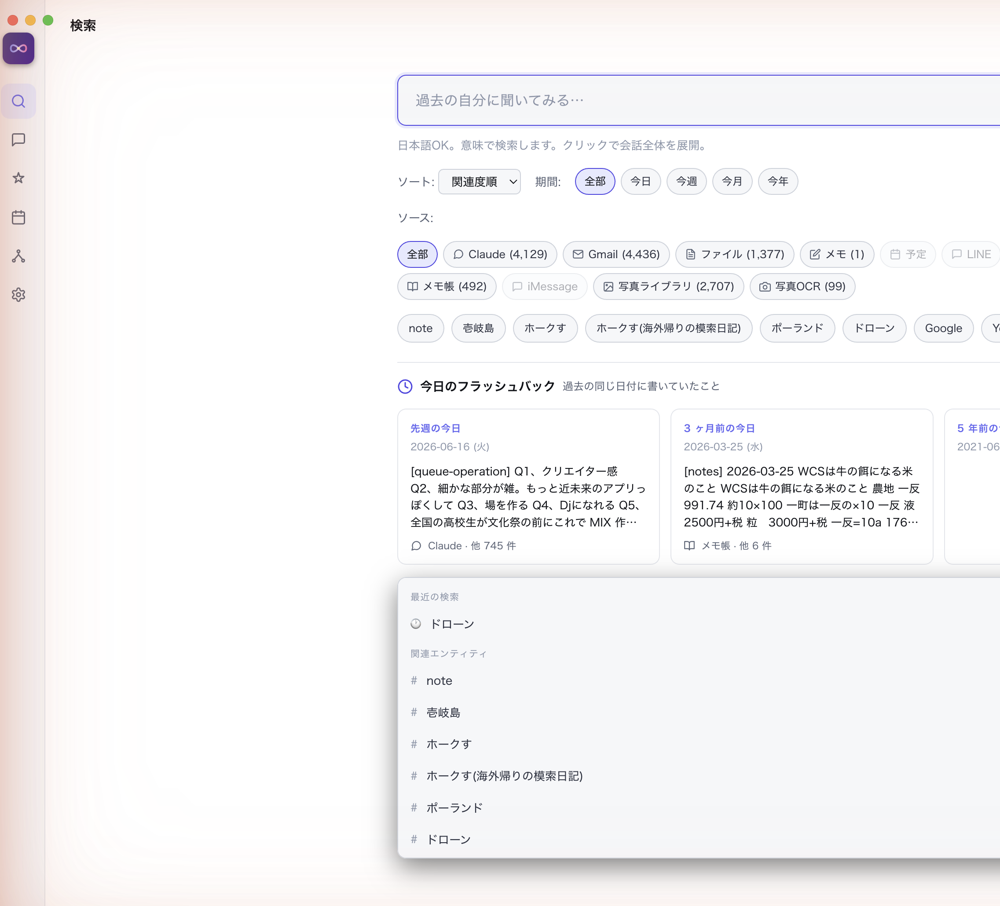
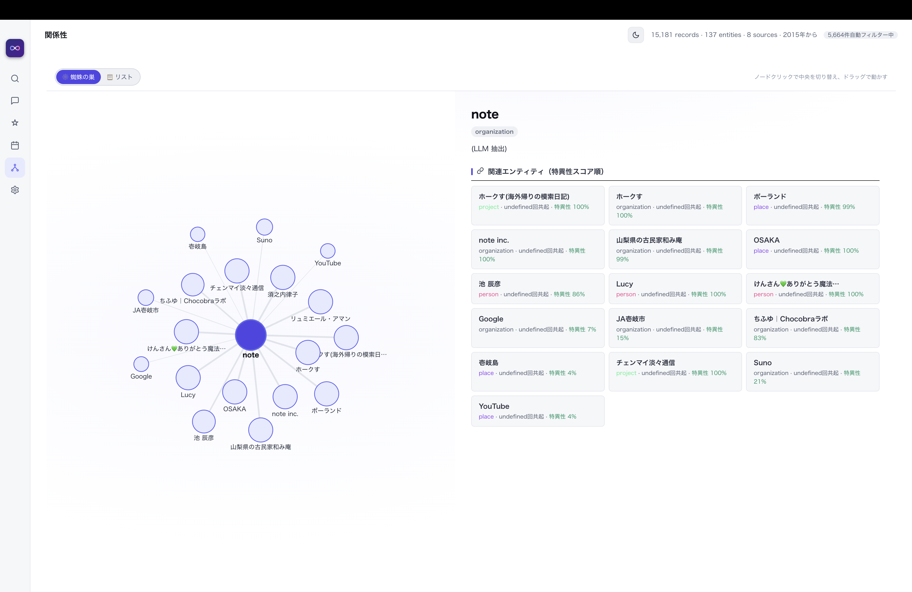
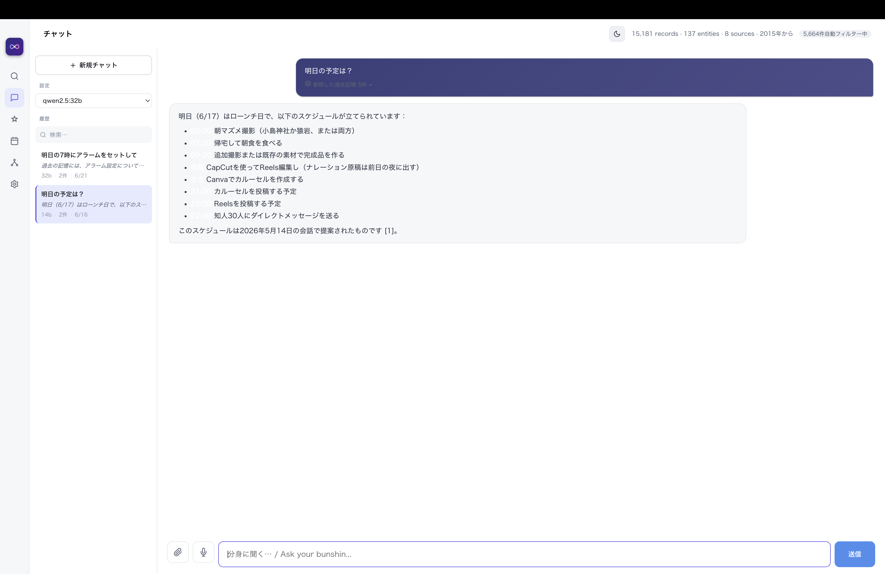

<div align="center">

# Bunshin (分身)

### **Your past is yours. AI is just the lens.**

A personal memory engine that ingests your emails, files, chats,
notes, photos, and browser history — then lets any LLM you choose
read it, *locally*.

[](https://github.com/Marine923/bunshin-ai/releases/latest)
[]()
[](LICENSE)
[]()

[Download for macOS ↓](https://github.com/Marine923/bunshin-ai/releases/latest) &nbsp;·&nbsp;
[日本語版 README](./README.ja.md) &nbsp;·&nbsp;
[Architecture](./ARCHITECTURE.md) &nbsp;·&nbsp;
[Contributing](./CONTRIBUTING.md)

</div>

<!-- ─────────────────────────────────────────────────────────────
     HERO SCREENSHOTS — add three 1600×1000 PNGs (or HEIC→PNG) to
     docs/screenshots/ to bring this section to life. See
     docs/screenshots/README.md for the exact recipe.
     ────────────────────────────────────────────────────────────-->
<p align="center">
  
  
  
</p>

> ChatGPT and Claude are *personal assistants* — replaceable.
> Bunshin is your *brain's extension* — yours.

---

## The 4 Conditions (All Met)

| # | Condition | Description | Implementation |
|---|-----------|-------------|----------------|
| 1 | **Local-First** | All data stays on YOUR device | SQLite + sqlite-vec |
| 2 | **AI-Agnostic** | Works with any LLM (Claude, GPT, Gemini, Llama, …) | MCP protocol |
| 3 | **Offline-Capable** | Functions without internet | Ollama integration |
| 4 | **Omni-Source** | Ingests email, files, chats, notes, photos, browser history, calendar | 11 ingestion paths |

**To our knowledge, no other product satisfies all 4 conditions** (as of 2026-06).

---

## Why this matters

Today's AI products tie your memory to the vendor:

- ChatGPT remembers you, but you can't take that memory elsewhere
- Claude has memory features, but only in Anthropic's ecosystem
- Mem0, Letta, etc. are cloud-based services by default (OSS self-host variants exist, but the hosted offering is the mainline product)

If your AI vendor changes pricing, shuts down, or you simply want to switch, **all your accumulated memory is gone**.

Bunshin inverts this: your memory lives on your machine, in a standard SQLite file. Any LLM that speaks the MCP protocol can use it. If Anthropic disappears tomorrow, your memory survives.

---

## What it does

### 🔍 Search anything you've ever encountered
Hybrid (semantic + BM25) search across every record. Japanese and English. Source filters, period filters, click-to-expand whole sessions, click-the-badge for sibling chunks.

### 💬 Chat with offline LLM grounded in your past
Local Ollama with auto-injected past-record context. Citations link back to source records. No data leaves your machine.

### 💡 Auto-generated daily insights
Dormant projects, upcoming calendar events, recent file changes, pending questions from past assistants. One tab to start your day.

### 📅 Timeline
Every record grouped by day and source. Today / yesterday markers. Per-source pill icons (💬 Claude, 📧 Gmail, 📓 notes, 📷 photos, 🌐 browser …). Click a pill to drill into that day, hover a record to expand it.

### 🕸 Knowledge graph
LLM-extracted entities (people, projects, organizations) with specificity-scored relations.

### 🔁 Always up to date
File watcher catches edits in seconds. launchd / systemd / cron syncs every hour. Automatic daily backups (`VACUUM INTO`).

### 🤖 MCP for any AI
Claude Code, Claude Desktop, or any MCP-aware LLM can call `search_memory` and `recall_session` against your records.

---

## Ingestion sources (11 paths)

| Source | What goes in | Path |
|--------|--------------|------|
| 💬 Claude | Every Claude Code / Claude Desktop transcript | `~/.claude/projects/**/*.jsonl` |
| 📧 Gmail | Last 90 days of mail (incremental after that) | Gmail API + App Password |
| 📄 Files | `.md` / `.txt` / `.pdf` / `.docx` under a watched root | Walkable directory |
| 📓 Apple Notes | Every note from Notes.app via AppleScript (no FDA) | macOS only |
| 💌 iMessage / SMS | `chat.db` joined with handles + group names | macOS, FDA required |
| 📷 Photos | EXIF (date, GPS, camera) + macOS Vision OCR (JP + EN) | `~/Pictures` or any dir |
| 📷 Photos.app library | All media items from Photos.app via AppleScript | macOS only |
| 🌐 Browser | Safari / Chrome / Arc visit history | macOS |
| 📅 Calendar | Next 14 days from any iCal URL | iCloud, Google, etc. |
| 🔊 Audio | Whisper transcription (3 backends: faster-whisper, openai-whisper, whisper-cpp) | Any audio file |
| 💭 Manual | `bunshin note "…"` or `覚えといて: …` in chat | Anywhere |

PDFs without an embedded text layer (scanned documents) are automatically routed through macOS Vision OCR via PDFKit + CoreGraphics page rendering — including business cards, quote sheets, and receipts.

---

## Quick start

### Install the Mac app (recommended)

1. Download the latest DMG from [Releases](https://github.com/Marine923/bunshin-ai/releases/latest):
   - **Apple Silicon (M1/M2/M3/M4)**: `Bunshin-x.y.z-arm64.dmg`
   - **Intel Mac**: `Bunshin-x.y.z.dmg`
2. Open the DMG, drag Bunshin to `/Applications`.
3. First launch: right-click → Open (macOS quarantine).

The app handles initial setup, runs `bunshin web` in the background, and gives you the full UI immediately.

### Or install from source

```bash
git clone https://github.com/Marine923/bunshin-ai.git
cd bunshin
python3.11 -m venv ~/.bunshin/venv
~/.bunshin/venv/bin/pip install -e .

# Initialize
~/.bunshin/venv/bin/bunshin init

# Pull what you have (Claude history is the fastest first import)
~/.bunshin/venv/bin/bunshin import-claude
~/.bunshin/venv/bin/bunshin embed

# Open the web UI
~/.bunshin/venv/bin/bunshin web
# → http://127.0.0.1:8000

# Check setup health any time
~/.bunshin/venv/bin/bunshin doctor
```

See [`docs/SETUP.md`](docs/SETUP.md) for Gmail, Calendar, Ollama, MCP, and scheduler setup.

---

## Architecture

```
┌──────────────────────────────────────────────────────────┐
│ Entry points: CLI · Web UI · MCP server · Electron app   │
├──────────────────────────────────────────────────────────┤
│ Core: search · chat · insights · knowledge graph         │
├──────────────────────────────────────────────────────────┤
│ Storage: SQLite + sqlite-vec  (~/.bunshin/data.db)       │
│ Embeddings: intfloat/multilingual-e5-large (1024d, ONNX) │
│ Hybrid search: vector + FTS5 BM25 via reciprocal-rank    │
├──────────────────────────────────────────────────────────┤
│ Ingestion: Claude · Gmail · files · Notes · iMessage     │
│            photos · Photos.app · browser · calendar      │
│            audio · manual                                │
└──────────────────────────────────────────────────────────┘
        ↑                                          ↑
    Ollama (offline)                Claude / GPT / Gemini (via MCP)
```

Details in [`docs/ARCHITECTURE.md`](docs/ARCHITECTURE.md).

---

## Real-world numbers

A live install on the developer's MacBook holds:

```
Source          Records
─────────────  ────────
claude          ~2,400   conversation turns
gmail           ~1,650   messages
photos_app      ~2,700   media items (1,113 with GPS)
file              ~900   docs (.md, .txt, .pdf, .docx)
browser           ~600   visits
notes             ~490   Apple notes
photo              ~99   loose images (with OCR text)
manual              1
─────────────  ────────
Total           ~8,650   records
Embeddings      ~9,200   (1024-d, e5-large)
```

OCR on the photo set recovered, among other things, an entire DJI T25P quote sheet (¥4,028,264, with vendor address, item breakdown, and bank details) — fully searchable.

---

## Documentation

- [`docs/SETUP.md`](docs/SETUP.md) — Full setup guide
- [`docs/COMMANDS.md`](docs/COMMANDS.md) — All CLI commands
- [`docs/ARCHITECTURE.md`](docs/ARCHITECTURE.md) — Internal design
- [`docs/TROUBLESHOOTING.md`](docs/TROUBLESHOOTING.md) — Common issues
- [`CHANGELOG.md`](CHANGELOG.md) — Release notes

---

## Status

```
Phase 0  Prototype                        ━━━━━━━━━━━━━━━━━━━━ 100%
Phase 1  MVP (search / chat / ingest)     ━━━━━━━━━━━━━━━━━━━━ 100%
Phase 2  Native Mac app (Electron)        ━━━━━━━━━━━━━━━━━━━━ 100%
Phase 3  Multi-source ingestion polish    ━━━━━━━━━━━━━━━━━━━━ 100%   ← v0.3.x
Phase 4  Pro / Team features              ░░░░░░░░░░░░░░░░░░░░   0%
```

### Known limitations

- **macOS only** for now. Linux scheduler exists (`systemd --user` / `cron`); UI works in any browser. Windows untested.
- **macOS code signing** not configured — first launch needs right-click → Open, or `xattr -dr com.apple.quarantine /Applications/Bunshin.app`.
- **iMessage requires Full Disk Access** on the terminal / Python process. The CLI prints a Japanese guide when it can't read `chat.db`.
- **Photos.app OCR** is opt-in via `--with-ocr` because each item has to be exported through Photos.app first (slow).
- **Whisper** backends need a separate `pip install` (we don't ship one by default).

---

## Customizing for your context

Bunshin ships with no personal data. To make the knowledge graph aware of your own organizations, places, and concepts, create `~/.bunshin/entities.json`:

```json
[
  {
    "name": "My Company",
    "type": "organization",
    "aliases": ["MyCo", "MCO"],
    "description": "My main company"
  },
  {
    "name": "Tokyo",
    "type": "place",
    "aliases": ["東京"]
  }
]
```

Then run `bunshin graph rebuild` to link existing records.

Types: `project`, `organization`, `person`, `place`, `tool`, `concept`, `topic`.

---

## License

MIT — see [LICENSE](LICENSE).

---

## Contributing

Open issues for bugs and feature requests. PRs welcome — please discuss substantial changes in an issue first.

---

## Acknowledgments

Built on the shoulders of:
- [SQLite](https://sqlite.org) + [sqlite-vec](https://github.com/asg017/sqlite-vec)
- [FastEmbed](https://github.com/qdrant/fastembed) (ONNX, no torch)
- [FastAPI](https://fastapi.tiangolo.com/) + [Uvicorn](https://www.uvicorn.org/)
- [Ollama](https://ollama.com)
- [MCP](https://modelcontextprotocol.io/) protocol from Anthropic
- [Electron](https://www.electronjs.org/) + [electron-builder](https://www.electron.build/)
- macOS Vision framework (text recognition)
- [Claude Code](https://docs.anthropic.com/en/docs/claude-code) (used to write 90% of this)

---

## 日本語ドキュメント

完全な日本語版は [`README.ja.md`](README.ja.md)。
